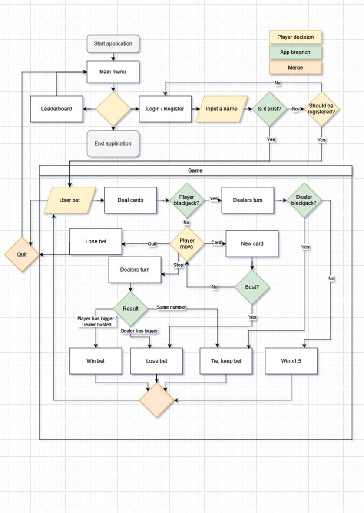

# Blackjack

Blackjack is one of the most famous casino game. Requires not just luck, but knowledge of the best strategy. Try yourself against the house. Reach more than the house and take all the chips. [Blackjack](https://blackjack-nyz-4419f61705c1.herokuapp.com/)

You can play the real simulation of the game with real shuffling system with real odds, and rules. For learn more about the game read the relevant [Wikipedia](https://en.wikipedia.org/wiki/Blackjack) page.

## Contents
  - [Application Goals](#application-goals)
  - [Planning](#planning)
  - [Features](#features)
    - [Loading Screen](#loading-screen)
    - [Main Menu](#main-menu)
    - [Leaderboard](#leaderboard)
    - [Login and Registration](#login-and-registration)
    - [Game](#game)
    - [Shuffle](#shuffle)
    - [Bet](#bet)
    - [Deal](#deal)
    - [Player Move](#player-move)
    - [Dealer Move](#dealer-move)
    - [Turn End](#turn-end)
    - [Future Implementations](#future-implementations)
- [Technologies Used](#technologies-used)
    - [Used Language](#used-language)
    - [Used Applications](#used-applications)
    - [Libraries](#libraries)
- [Deployment and Local Development](#deployment-and-local-development)
  - [Heroku](#heroku)
  - [Local Development](#local-development)
    - [How to Fork](#how-to-fork)
    - [How to Clone](#how-to-clone)
- [Testing](#testing)
  - [Detailed Testing](#detailed-testing)
  - [Fixed Bugs](#fixed-bugs)
  - [PEP 8 Style Checker](#pep-8-style-checker)
- [Credits](#credits)
  - [Source](#source)
  - [Acknowledgements](#acknowledgements)

## Application Goals

 - Have a "database" what holds the player names and their chips.
 - Possibility to register a new player.
 - Leaderboard among of the players by chips.
 - The players can enter the game with his name.
 - The game itself with real game flow.
   - Card shaffle and deal with the same probaibilities as in the real world.
   - Same rules, moves in the same order as in a real cassino.

## Planning

All the options what the player can do in the application is visible on the player experience flowchart below.

## Features

### Loading Screen

As the application is started blackjack title and "loading..." text appear. The appliction reaches out the google sheet via Gspread, when it is succeeded "Welcome!" text appears and we enter the main menu.

### Main Menu

From here the player can
 - go to leaderboard
 - go to login / registration
 - or close the application.
Also, the player can return here from everywhere.

### Leaderboard

Here shows up the top 10 player by chips.

### Login and Registration

The player enters his player name here, if it's already exist than enters to the game. If isn't than he can register it if he decides to do so.

### Game

Game starts with shuffle than the players bet.

#### Shuffle

Every time the cars are shuffled
  - in the beginning of the game
  - and if the most of the cards already played from the deck
the application notify the user about it.

#### Bet

The player can place his bet.

#### Deal

After betting. The player gets 2 cards and the dealer one. These cards will be removed from the deck until a new shuffle. And the player can see the cards. In case of the player has blackjack the player wins except the dealer has also blackjack. In this case it's a tie.

#### Player Move

Seeing the cards the player can decide his move.
 - He can either ask a new card
 - or stop.

#### Dealer Move

After the player finished his turn. It's the dealers turn. All the new card appears with a 2 second delay.

#### Turn End

In the end the player gets his reward or loses his bet depending of he or the dealer had better cards or any of them busted and gets back his chips if it was a tie.

### Future Implementations

In the future will be possible doubling down and card splitting as player moves.

## Technologies Used

### Used Language

The code was written in Python.

### Used Applications

| Application | It was used to |
| --- | --- |
| drow.io | Drow flowchart. |
| Github | save project. |
| Git | manage versions. |
| Heroku | deploy project. |
| Sublime text | develop Python code. |
| tinypng.com | reduce image sizes in documentation. |
| Ms office word | correct spelling. |

### Libraries

 - gspead
 - random
 - time
 - google.oauth2.service_account

## Deployment and Local Development

### Heroku

The Application has been deployed from GitHub to Heroku by following the steps:

1. Create or log in to your account at heroku.com
2. Create a new app, add a unique app name (for example blackjack-nyz) and then choose your region
3. Click on create app
4. Go to "Settings"
5. Under Config Vars add the private API key information using key 'CRED' and into the value area copy the API key information added to the .json file.  Also add a key 'PORT' and value '8000'.
6. Add required buildpacks (further dependencies). For this project, set it up so Python will be on top and Node.js on bottom
7. Go to "Deploy" and select "GitHub" in "Deployment method"
8. To connect Heroku app to your Github repository code enter your repository name, click 'Search' and then 'Connect' when it shows below.
9.  Choose the branch you want to build your app from
10. If preferred, click on "Enable Automatic Deploys", which keeps the app up to date with your GitHub repository
11. Wait for the app to build. Once ready you will see the “App was successfully deployed” message and a 'View' button to take you to your deployed link.

### Local Development

#### How to Fork

To fork the repository:

1. Log in (or sign up) to Github.
2. Go to the repository for this project, [ZoltanNyaradi/Blackjack](https://github.com/ZoltanNyaradi/Blackjack/deployments).
3. Click the Fork button in the top right corner.

#### How to Clone

To clone the repository:

1. Log in (or sign up) to GitHub.
2. Go to the repository for this project, [ZoltanNyaradi/Blackjack](https://github.com/ZoltanNyaradi/Blackjack/deployments).
3. Click on the code button, select whether you would like to clone with HTTPS, SSH or GitHub CLI and copy the link shown.
4. Open the terminal in your code editor and change the current working directory to the location you want to use for the cloned directory.
5. Type 'git clone' into the terminal and then paste the link you copied in step 3. Press enter.

## Testing

### Detailed Testing

Manual testing can be found in the [TESTING.md](TESTING.md) file.

### Fixed Bugs

| Bug | Cause | Solution |
| --- | --- | --- |
| Type miss match at compering player and dealer hand. | List of player cards was compered to value of dealer hand. | Value of the player hand was passed to there and changed with the list. |
| Missing variable. | The same variable had two different names. | The variable was unified. |
| Syntax error. | ++ doesn't exist in Python. | +=1 was used instead. |
| Deployment wasn't successful. | One import had a typo in requirement. | It was corrected.|
| Some hands had wrong value. | From the card 10 only the "1" was cut out. So it had the value of 1. | "1" is handled now as "J", "Q" and "K" not as a number. |
| Every card had the value of 10 | Fixing the previous error "1" was used instead of card=="1" in the if statement so it was always true. | The statement was finished, as it should be. |

### PEP 8 Style Checker

To check and upgrade code style [code:wof](https://www.codewof.co.nz/style/python3/) was used.

## Credits

### Source

Blackjack image originated from Pixabay.

### Acknowledgements

I would like to thank for
 - my mentor Jubril Akolade who helped me with his valuable views.
 - Juhász Áron who tried the game.
 - Code Institute for teaching me Python and Gspread.

